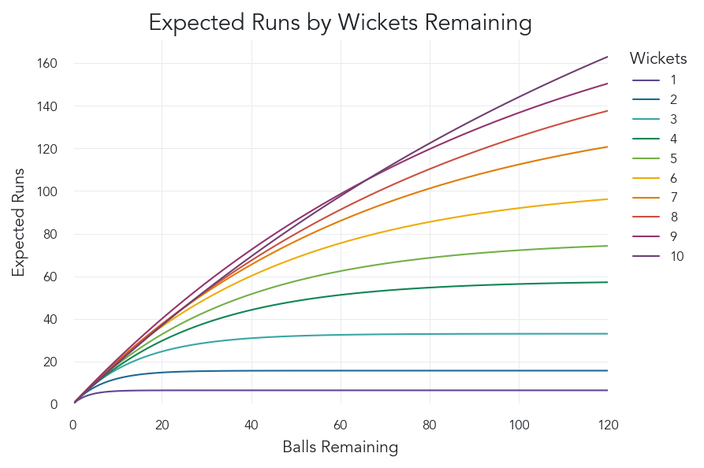
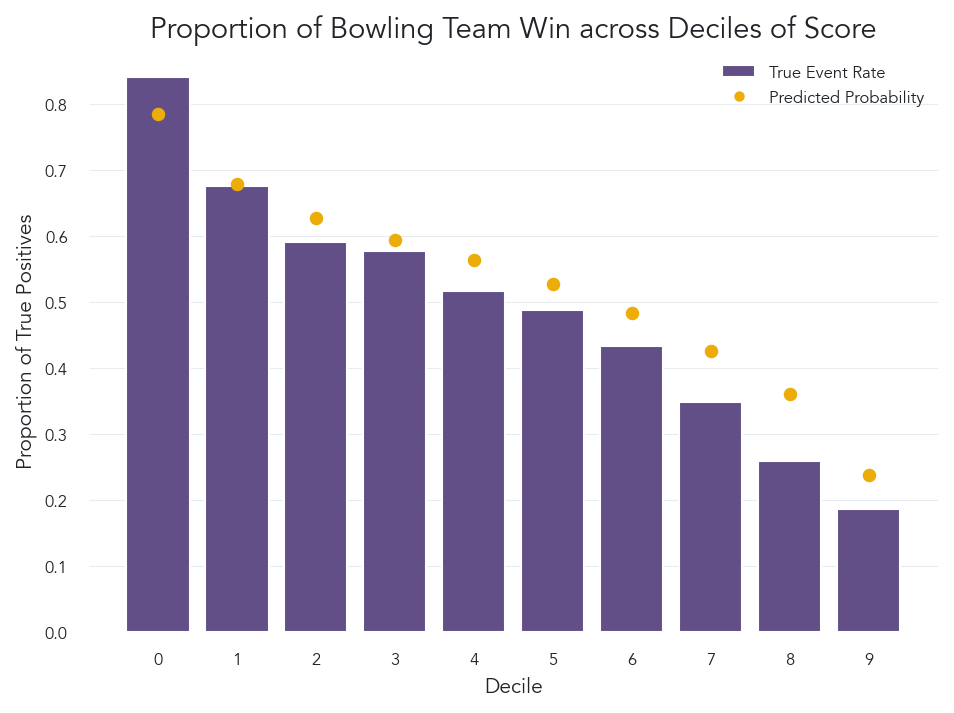
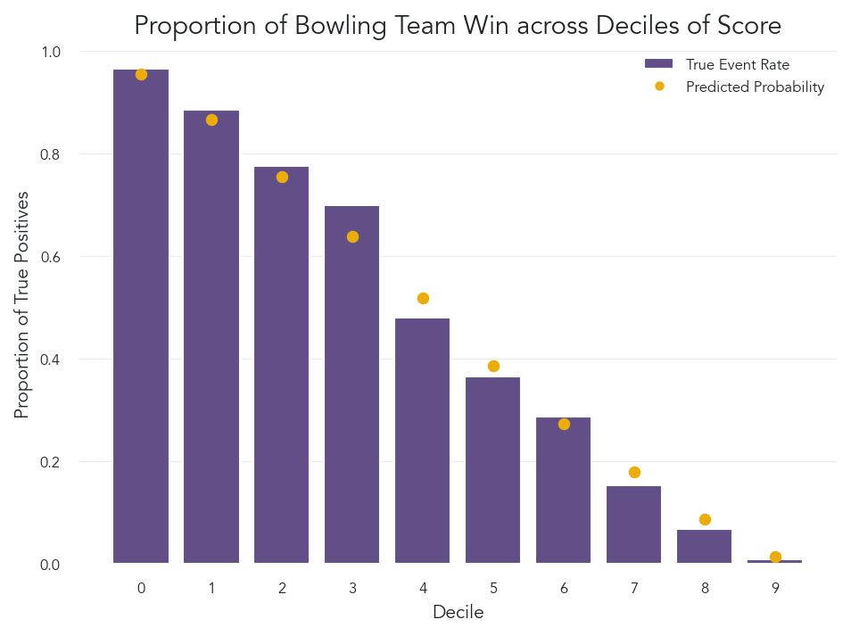
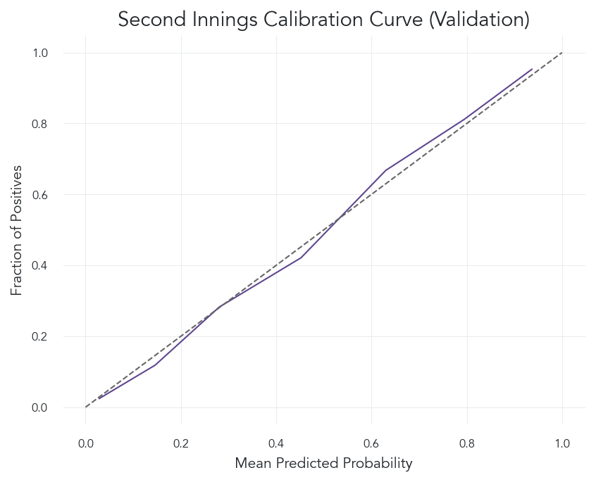
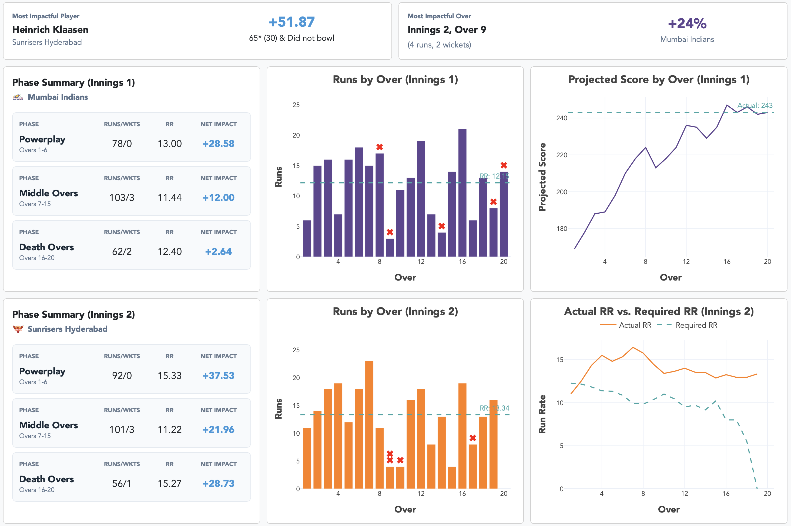

# IPL Match Analytics

This project builds a ball-by-ball analytics framework for the Indian Premier League (IPL), delivering real-time win probability estimation, score projection, and context-aware player impact analysis through an interactive dashboard for live and historical match analytics.

## What is Cricket? (Quick Overview)

Cricket is a bat-and-ball sport where two teams compete to score more runs than their opponent. In the Twenty20 (T20) format used in the IPL, each team bats once for up to 20 overs (120 balls), attempting to maximize runs while the opposing team bowls and fields to limit scoring and take wickets (outs).

The match is played in two innings: the first team sets a target score, and the second team attempts to chase that target within the same 20-over limit. The dynamic relationship between runs, balls remaining, and wickets remaining creates a rich decision-making environment, which this project models through win probability and impact analysis.

## Project Overview

Using historical IPL delivery data, I developed models to estimate first-innings projected score, first-innings win probability, second-innings win probability, and player impact by measuring how each delivery changes a team’s probability of winning.

The project moves beyond traditional scorecard statistics by incorporating match context. A run, wicket, dot ball, or boundary can have very different value depending on the situation, and this framework quantifies that value directly through win probability shifts.

The repository includes a fully built interactive dashboard using Dash and Plotly. The dashboard is designed for both historical analysis and real-time prediction during live matches through a live ingestion pipeline. The public repository does not expose the private live API integration used in deployment, but the dashboard and modeling framework are structured around that real-time analytics capability.

## Project Highlights

- Built a first-innings score projection model inspired by Duckworth-Lewis resource principles.
- Built separate logistic regression win probability models for first- and second-innings match states.
- Validated models on future IPL seasons from 2022–2025 after training on 2008–2021 data.
- Developed a ball-by-ball impact framework based on changes in win probability.
- Created an interactive dashboard for historical exploration and live match prediction.
- Designed the system around a SQLite-backed data workflow with Python, scikit-learn, Dash, and Plotly.

## Tech Stack

- Python (pandas, SciPy, scikit-learn)
- Matplotlib and Seaborn (model evaluation visuals)
- Dash + Plotly (interactive dashboard)
- SQLite (data storage and querying)

---

## Results Summary

The models were trained on IPL matches from **2008–2021** and validated on matches from **2022–2025**. This time-based validation structure was used to evaluate how well the models generalize to more recent IPL seasons rather than relying on a random split across historical deliveries.

### Model Performance

| Model | Primary Task | Validation Metric Highlights |
|---|---:|---:|
| First-Innings Score Predictor | Project final first-innings score | MAE: **18.11 runs**, RMSE: **24.96 runs**, MAPE: **9.77%** |
| First-Innings Win Probability | Estimate win probability before target is known | Accuracy: **65.02%**, AUC: **0.713**, Brier: **0.218** |
| Second-Innings Win Probability | Estimate win probability during a chase | Accuracy: **79.52%**, AUC: **0.881**, Brier: **0.141** |

The second-innings model performs substantially better than the first-innings model, which is expected. Once a chase target is known, the match state is more constrained and the key variables such as runs required, balls remaining, wickets remaining, and required run rate carry stronger predictive signal.

The first-innings model is inherently more uncertain because the batting team is setting a target rather than chasing one. In that setting, the model must infer the eventual value of the innings from available resources and scoring context, without knowing how difficult the target will ultimately be for the opposition.

---

## First-Innings Score Projection

The first-innings score predictor estimates a team’s final score from any point in the innings based primarily on available batting resources: balls remaining and wickets remaining.

Validation performance on IPL matches from **2022–2025**:

| Metric | Value |
|---|---:|
| MAE | **18.11 runs** |
| MAPE | **9.77%** |
| MSE | **623.02** |
| RMSE | **24.96 runs** |

The model is typically within approximately **18 runs** of the final first-innings score on the validation set. This level of error is reasonable given the natural volatility of T20 batting, especially early in an innings when many scoring trajectories are still possible.

The model was designed to preserve cricket logic. More flexible machine learning models can sometimes improve aggregate error metrics while producing projections that do not behave consistently with resources remaining. In contrast, the resource-based structure ensures that projected scoring potential remains aligned with the relationship between wickets, balls remaining, and expected final score.

<!-- Replace the path below with your actual file path -->


*Resource curve by wickets remaining. This visual shows how scoring potential changes as batting resources decline, helping ensure that the projection framework remains consistent with cricket intuition.*

A key modeling caveat is heteroskedasticity. Early-innings predictions naturally have higher variance because a wider range of final scores is still possible. Later in the innings, uncertainty narrows as the remaining number of balls decreases. This is not treated as a modeling failure; it reflects the structure of the game.

---

## First-Innings Win Probability Model

The first-innings win probability model estimates the batting team’s probability of winning before a chase target has been set.

Validation performance on IPL matches from **2022–2025**:

| Metric | Value |
|---|---:|
| Accuracy | **65.02%** |
| AUC | **0.7128** |
| KS Statistic | **0.3008** |
| Brier Score | **0.2176** |
| Coefficient of Discrimination | **0.1149** |

This model captures general first-innings match position, but its predictive ceiling is naturally lower than the second-innings model because the final target and chase dynamics are not yet known.

The AUC of **0.713** indicates that the model has meaningful discriminatory power, while the Brier score provides a probability-quality check beyond simple classification accuracy. Since this model is used to support impact analysis, probability calibration is especially important.

<!-- Replace the path below with your actual file path -->


*First-innings decile analysis on the 2022–2025 validation set. Bars represent observed win rates within each probability bin, while markers show the corresponding mean predicted probabilities. Close alignment between the two indicates good calibration, which is essential for meaningful impact analysis.*

---

## Second-Innings Win Probability Model

The second-innings win probability model estimates the chasing team’s probability of winning from any point in the chase.

Validation performance on IPL matches from **2022–2025**:

| Metric | Value |
|---|---:|
| Accuracy | **79.52%** |
| AUC | **0.8807** |
| KS Statistic | **0.5902** |
| Brier Score | **0.1405** |
| Coefficient of Discrimination | **0.4181** |

The second-innings model is the strongest predictive component of the project. Its AUC of **0.881** suggests strong ranking ability between winning and losing match states, while the Brier score of **0.141** indicates substantially better probability quality than the first-innings model.

This performance difference is expected. In a chase, the target is fixed, and the model can directly evaluate the relationship between runs required, balls remaining, wickets remaining, and required run rate.




*Second-innings decile analysis on the 2022–2025 validation set. The strong alignment between observed win rates and predicted probabilities across bins highlights the model’s reliability in match situations where win probability estimates are most critical.*

<!-- Replace the path below with your actual file path -->


*Second-innings calibration curve on the 2022–2025 validation set. The near-diagonal trend indicates consistent calibration across the full probability range, reinforcing the model’s suitability for ball-by-ball impact analysis.*

---

## Impact Analysis

The core analytical idea of the project is to evaluate not just what happened on a delivery, but how much it changed the match.

For each ball, the model estimates win probability before and after the delivery.

```text
Delivery Impact = Post-Ball Win Probability - Pre-Ball Win Probability
```

For example, in a second-innings chase:
- Before the ball: win probability = 48%
- After a wicket: win probability = 36%

This −12% shift reflects the high leverage of wickets during a balanced middle-over phase.

From the batting team’s perspective, a positive value means the delivery improved the team’s chance of winning. A negative value means it reduced the team’s chance of winning. From the bowling team’s perspective, the sign can be reversed so that wicket-taking, dot-ball pressure, and defensive bowling are credited appropriately.

This creates a context-aware measure of player and team contribution.

For example:

- A boundary in a close chase may be worth significantly more than a boundary when the chasing team is already in control.
- A wicket during a balanced middle-over phase may create a larger swing than a wicket when the match is nearly decided.
- A dot ball in the final overs of a tight chase can have meaningful positive impact for the bowling team.
- Low-leverage events receive less weight because they do not materially change the expected outcome.

This framework allows performance to be aggregated by player, team, innings, season, role, and match phase.

---

## Dashboard and Real-Time Analytics

The project includes a fully built interactive dashboard using **Dash** and **Plotly**.

The dashboard supports both historical analysis and live match prediction. It is designed around a live ingestion workflow where match data can be continuously updated, stored, transformed, and passed through the trained modeling pipeline to refresh predictions in near real time.

Key dashboard capabilities include:

- live win probability tracking during active matches;
- first-innings projected score updates;
- second-innings chase probability updates;
- ball-by-ball impact analysis;
- match momentum visualization;
- team and player performance breakdowns;
- phase-based analysis across powerplay, middle overs, and death overs;
- historical comparison across IPL seasons.

Live ingestion is not available in the public repository, as it depends on a private API integration used in deployment. However, the dashboard fully supports historical match analysis, with all IPL matches accessible for exploration, demonstrating the core data architecture, feature engineering, modeling, and visualization framework.

<!-- Optional: add dashboard screenshot -->


*Interactive dashboard for historical exploration and live match analytics.*

---

## Key Analytical Takeaways

- **Second-innings prediction is substantially stronger than first-innings prediction.**  
  The second-innings model benefits from a known target and more clearly defined match constraints, producing an AUC of **0.881** and validation accuracy of **79.52%**.

- **First-innings uncertainty is structurally unavoidable.**  
  Before a target is set, match outcomes depend not only on the current innings but also on how the opposition will respond. The first-innings model still provides useful signal, with an AUC of **0.713**, but carries more uncertainty by design.

- **Calibration is central to the impact framework.**  
  Since player impact is calculated from changes in win probability, the models need to produce meaningful probabilities rather than only accurate classifications.

- **Resource-based score projection improves interpretability.**  
  The first-innings score model maintains a logical relationship between wickets remaining, balls remaining, and scoring potential, which is important for cricket credibility and analyst trust.

- **The dashboard turns the modeling work into a usable analytics product.**  
  The system is not just a historical analysis tool; it is designed to support real-time match prediction and live decision-context analytics.

---

## Acknowledgements

This project was developed as a personal side project and portfolio passion project during my Master’s in Analytics studies at the [Institute for Advanced Analytics](https://analytics.ncsu.edu/) at [NC State University](https://www.ncsu.edu/).

I would like to thank Professor Susan Simmons and Professor Andrea Villanes for their advice, guidance, and helpful conversations throughout the development of this project.

---

## License

This project is licensed under the MIT License.

## Disclaimer

This is an independent, non-commercial student analytics project created for educational and portfolio purposes. The project is not affiliated with, endorsed by, or sponsored by the Indian Premier League, the Board of Control for Cricket in India, or any IPL franchise.

IPL team names, match data, and related references are used only for descriptive and analytical purposes.

